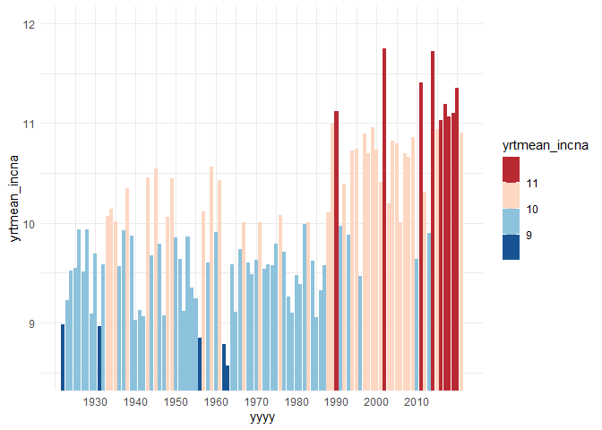
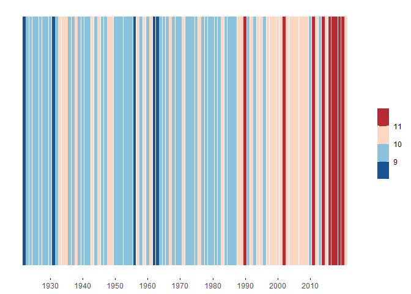
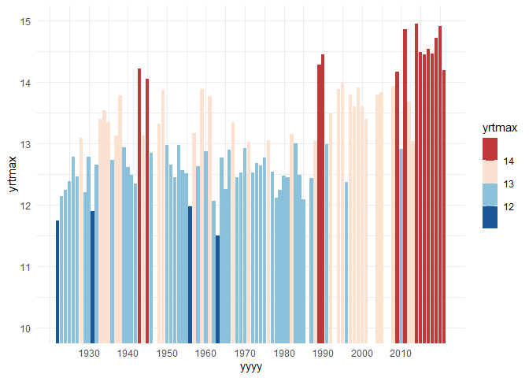
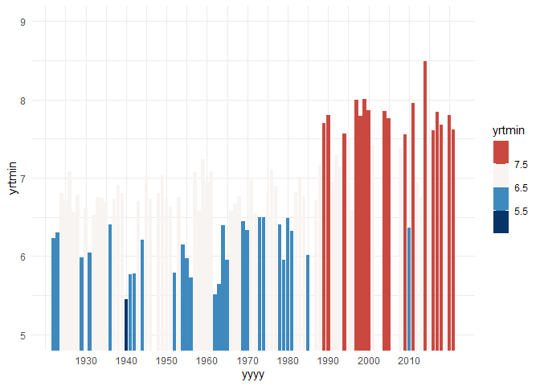

climatefence R code
================

The R code to create the design in 2020-1 to paint my garden fence to
represent climate change.

The UK Meteorological Office provides near complete monthly data for
Lowestoft from 1921, recording started in 1914. This is the closest
weather station to my house in Norwich (35 km away as the crow flies -
and a lot do on the route).

The data include monthly minimum and maximum temperatures, I calculated
the midpoint between them for each month.

``` r
infileurl <- "https://www.metoffice.gov.uk/pub/data/weather/uk/climate/stationdata/lowestoftdata.txt"

# use readr to read the data and cope with some trickiness
library(readr)

# skip first 6 rows that contain metadata
# "nnnn___" ensures first 4 columns numeric & skips others
dfraw <- readr::read_table(infileurl, skip=6, col_names=TRUE, col_types="nnnn___")

# remove 2nd header row
dfmonthly <- dfraw[-1,]

# extract from 1922 onwards for consistent monthly records
dfmonthly <- dfmonthly[ which(dfmonthly$yyyy > 1921),]

# calculate midpoint as halfway between min & max
dfmonthly$tmean <- 0.5*(dfmonthly$tmin + dfmonthly$tmax)
```

Starting to calculate yearly mean from the monthly data.

todo : mention missing data.

``` r
library(dplyr)
```

    ## 
    ## Attaching package: 'dplyr'

    ## The following objects are masked from 'package:stats':
    ## 
    ##     filter, lag

    ## The following objects are masked from 'package:base':
    ## 
    ##     intersect, setdiff, setequal, union

``` r
dfyearly <- dfmonthly %>%
            group_by(yyyy) %>%
            summarise(yrtmean = mean(tmean),
                      yrtmean_incna = mean(tmean, na.rm=TRUE), #calc means without missing months
                      yrtmin = mean(tmin),
                      yrtmax = mean(tmax),
                      sumNA = sum(is.na(tmean)))
```

Starting to plot yearly coloured stripes using [code borrowed from
Dominic
Roye](https://dominicroye.github.io/en/2018/how-to-create-warming-stripes-in-r/).

``` r
library(ggplot2)
library(RColorBrewer)

theme_strip <- theme_minimal()+
  theme(axis.text.y = element_blank(),
        axis.line.y = element_blank(),
        axis.title = element_blank(),
        panel.grid.major = element_blank(),
        legend.title = element_blank(),
        axis.ticks.x = element_line(),
        panel.grid.minor = element_blank(),
        plot.title = element_text(size = 14, face = "bold")
  )

# using ColorBrewer red - blue palette
col_strip <- brewer.pal(11, "RdBu")

ggplot(dfyearly,
       aes(x = yyyy, y = 1, fill = yrtmean))+
  geom_tile()+
  scale_y_continuous(expand = c(0, 0))+ #DRoye original
  scale_fill_gradientn(colors = rev(col_strip))+ #DRoye original
  #scale_fill_stepsn(colors = rev(col_strip), n.breaks=5)+
  guides(fill = guide_colorbar(barwidth = 1))+
  theme_strip
```

<!-- -->

todo : mention other colour experimentation

Just 4 colour bins. Using bar height to check that the colours are a
reasonable representation.

``` r
yrlabs <- seq(1930,2010,10)

# y height included to assess colour binning : (y = yrtmean_incna & geom_col())
ggplot(dfyearly,
       aes(x = yyyy, y = yrtmean_incna, fill = yrtmean_incna))+
  geom_col()+
  scale_x_continuous(breaks=yrlabs, labels=yrlabs) +
  scale_fill_stepsn(colors = rev(col_strip), n.breaks=4) +
  coord_cartesian( ylim=c(8.5, 12) ) +
  guides(fill = guide_colorbar(barwidth = 1)) +
  theme_minimal()
```

<!-- -->

Now standard warming stripes without bar height, as to paint on fence.

``` r
yrlabs <- seq(1930,2010,10)

ggplot(dfyearly,
       aes(x = yyyy, y = 1, fill = yrtmean_incna))+
  geom_col()+
  scale_x_continuous(breaks=yrlabs, labels=yrlabs) +
  scale_fill_stepsn(colors = rev(col_strip), n.breaks=4)+
  guides(fill = guide_colorbar(barwidth = 1)) +
  theme_strip
```

<!-- -->

For interest what would the min & max temp look like ?

``` r
ggplot(dfyearly,
       aes(x = yyyy, y = yrtmax, fill = yrtmax))+
  geom_col()+
  scale_x_continuous(breaks=yrlabs, labels=yrlabs) +
  scale_fill_stepsn(colors = rev(col_strip), n.breaks=4) +
  coord_cartesian( ylim=c(10, 15) ) +
  guides(fill = guide_colorbar(barwidth = 1)) +
  theme_minimal()
```

<!-- -->

``` r
ggplot(dfyearly,
       aes(x = yyyy, y = yrtmin, fill = yrtmin))+
  geom_col()+
  scale_x_continuous(breaks=yrlabs, labels=yrlabs) +
  scale_fill_stepsn(colors = rev(col_strip), n.breaks=4) +
  coord_cartesian( ylim=c(5, 9) ) +
  guides(fill = guide_colorbar(barwidth = 1)) +
  theme_minimal()
```

<!-- -->
